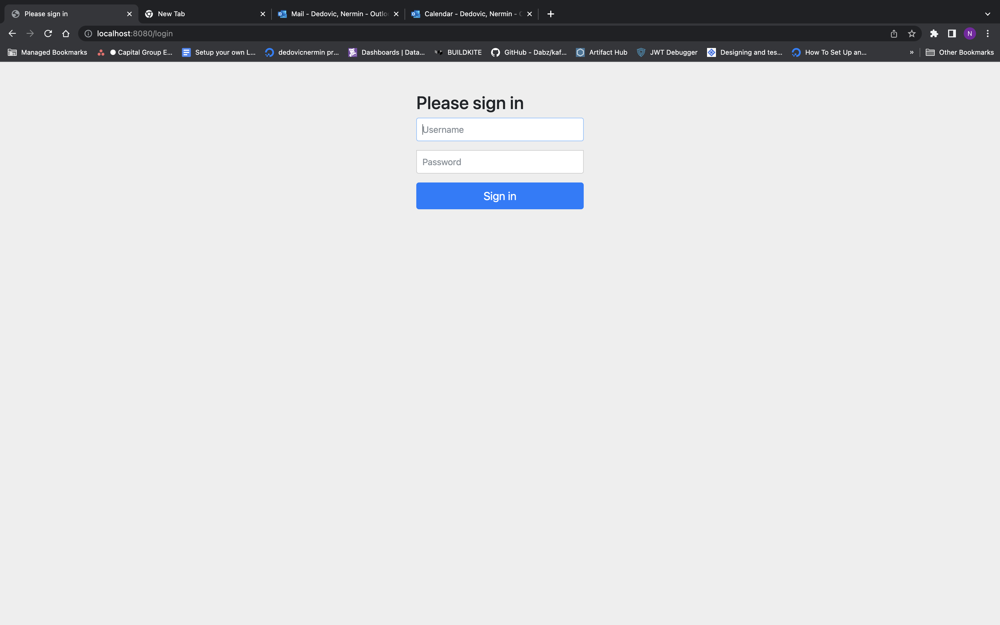
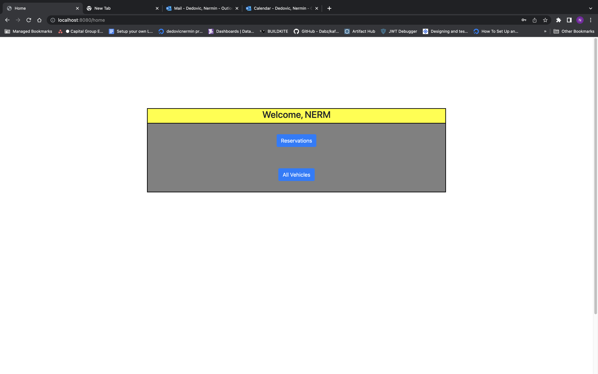
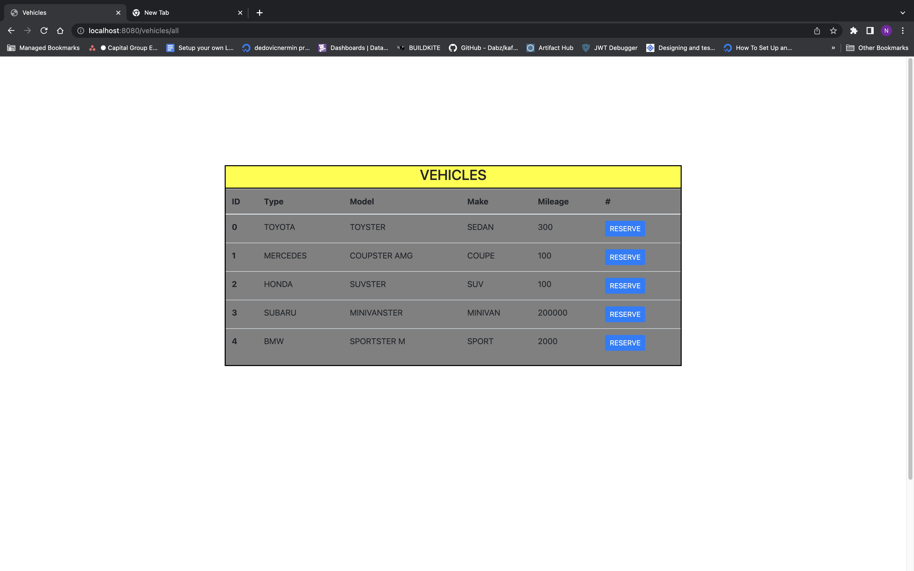
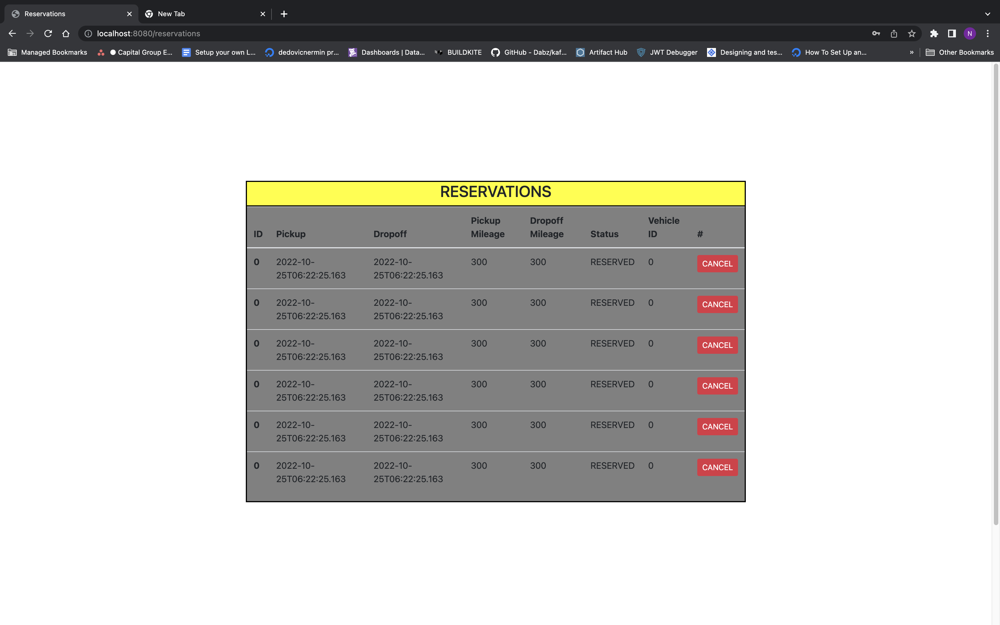
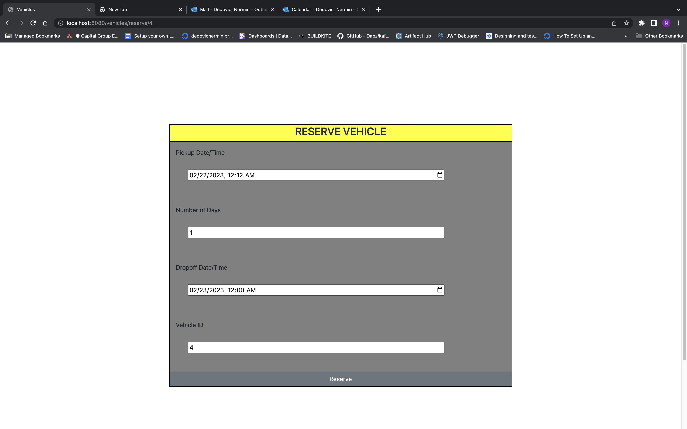

## Right of Way Rentals
This is a car rental reservation application for DePaul SE352/452.

[](https://buildkite.com/depaul-university/right-of-way-rentals-pipeline)

<br/>

## Documentation
Swagger UI: http://localhost:8080/swagger-ui/index.html


## Tools

| Tool                                                                                    | Used for           | commands      |
|-----------------------------------------------------------------------------------------|--------------------|---------------|
| [IntelliJ](https://www.jetbrains.com/idea/)                                             | Code Editor        |               |
| [GitHub Desktop](https://desktop.github.com/)                                           | Manage Git         |               |
| [GitFlow](https://www.atlassian.com/git/tutorials/comparing-workflows/gitflow-workflow) | Branching Strategy | refer to link |
| [SonarLint](https://www.sonarsource.com/products/sonarlint/)                            | Clean code         | IDE plugin    |
| [Docker Desktop](https://www.docker.com/products/docker-desktop/)                       | Manage Docker Pods |               |

## How to spin up via docker-compose
- In root directory, build the application image by executing `docker build -t rowr:latest .` 
  - The image is now available locally. To confirm, execute `docker image ls`
- 'cd' into `infra` directory
- run `docker-compose up -d`
- To verify the application is up/running - `docker ps` 
- To view application logs - `docker logs app [-f]`
  - `-f` to hang the terminal / follow along with logs

<br/>

### Current BUILD script (m3)
1. ensure you're in root of project (...-Right-Of-Way-Rentals)
2. execute from the command line : `mvn clean install`
3. execute from the command line : `docker build -t rowr:m3 . && cd infra && docker compose up -d`

### Access to OpenAPI / Swagger REST docs
http://localhost:8080/swagger-ui/index.html

```bash
# create customer
curl -X 'POST' \
  'http://localhost:8080/api/services/customers' \
  -H 'accept: */*' \
  -H 'Content-Type: application/json' \
  -d 'NERM' | jq . 

# create vehicle
curl -X 'POST' \
  'http://localhost:8080/api/services/vehicles' \
  -H 'accept: */*' \
  -H 'Content-Type: application/json' \
  -d '{
  "vehicleType": "TOYOTA",
  "vehicleMake": "SEDAN",
  "vehicleModel": "TOYSTER",
  "vehicleMileage": 300
}' | jq . 
  
# create reservation  
curl -X 'POST' \
  'http://localhost:8080/api/services/reservations' \
  -H 'accept: */*' \
  -H 'Content-Type: application/json' \
  -d '{
  "customerId": 1,
  "vehicleId": 1,
  "pickup": "2022-10-25T06:22:25.163Z",
  "numberWeeks": 1,
  "numberDays": 1,
  "dropOffTime": "8:10 AM"
}' | jq .

# get all vehicles
curl -s -X 'GET' \
  'http://localhost:8080/api/services/vehicles' \
  -H 'accept: */*' | jq .

# get all customers
curl -s -X 'GET' \
  'http://localhost:8080/api/services/customers' \
  -H 'accept: application/json' | jq . 

# Get all reservations 
curl -s -X 'GET' \
  'http://localhost:8080/api/services/reservations' \
  -H 'accept: */*' | jq .

# Get vehicle by ID 
curl -s -X 'GET' \
  'http://localhost:8080/api/services/vehicles/1' \
  -H 'accept: */*' | jq . 

# Get customer by ID 
curl -s -X 'GET' \
  'http://localhost:8080/api/services/customers/1' \
  -H 'accept: */*' | jq .

# Get reservation by ID 
curl -s -X 'GET' \
  'http://localhost:8080/api/services/reservations/1' \
  -H 'accept: */*' | jq .

# Get reservations referencing vehicle ID
curl -s -X 'GET' \
  'http://localhost:8080/api/services/reservations/vehicle/1' \
  -H 'accept: */*' | jq .

# Get reservations referencing customer ID
curl -s -X 'GET' \
  'http://localhost:8080/api/services/reservations/customer/1' \
  -H 'accept: */*' | jq .

# Get reservations referencing vehicle and customer ID's
curl -s -X 'GET' \
  'http://localhost:8080/api/services/reservations/multi?customer=1&vehicle=1' \
  -H 'accept: */*' | jq . 

  
```

## Contributors

| Contributors   | Contributions                                                 |
|----------------|----------------------------------------------------------------------------|
| Bryan Lee      | Service/Controller/Thymeleaf/Security/Relationship for Models **             |
| Nermin Dedovic | Service/Controller/Thymeleaf/Security/Relationship for Models **             |               
| Ethan Ly       | Service/Controller/Thymeleaf/Security/Relationship for Models **             | 

** We did a lot of pair programming to easily communicate with one another


## UI




